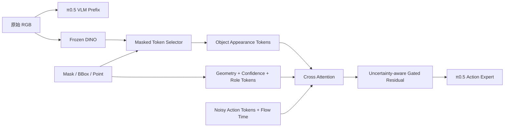

# 可以工程上对齐，但需要换一个更有辨识度的问题定义。

截至 2026 年 7 月，单纯做：

> DINO/SAM 提取目标物体 token → action expert cross\-attention
> 
> 

已经比较拥挤。AffordanceVLA 甚至已经实现了严格单向的 `Understanding → Affordance → Action`，最近的 POT\-VLA 也直接研究 persistent 3D object tokens。因此你的论文不能只强调“object token”，而应强调：

> **不完美目标定位条件下，如何用一个轻量、可插拔、对预训练策略低干扰的 object\-action adapter，提高 VLA 的精确性与鲁棒性。**
> 
> 

**论文缺口对照**

**我建议的切入点**

可以暂定为：

> **Robust Object\-Conditioned Action Adapter for VLA under Imperfect Grounding**
> 
> 

核心问题不是“显式 object token 有没有用”，而是：

> 当 mask、bbox、目标点存在偏移、缺失、误检和遮挡时，action expert 应当何时信任、信任多少，以及不同动作阶段应读取哪些物体信息？
> 
> 

这个问题是上述方法普遍没有系统回答的，而且与你当前工程高度匹配。

**推荐结构**

```Plain Text

```

建议实现：

```Plain Text
delta = CrossAttention(
    query=action_tokens + time_embedding,
    key=object_tokens,
    value=object_tokens,
)

gate = sigmoid(
    gate_mlp(action_tokens, flow_time, object_confidence)
)

action_tokens = action_tokens + gate * delta
```

这里相较 ACoT 多了两个关键点：

1. `Q` 不只是 noisy action，还显式知道 flow timestep。

2. gate 根据条件置信度和动作状态决定是否接受 object information。

**与你当前代码的关系**

你现有实现已经有很好的骨架：

- `[_embed_object_condition()](/Users/dongxiaokun/Desktop/imitation-learning/src/openpi/models/pi0.py:146)`\[ \(line 146\)\]\(/Users/dongxiaokun/Desktop/imitation\-learning/src/openpi/models/pi0\.py:146\)：生成 patch 与 geometry token。

- `[_cross_attend_object_condition()](/Users/dongxiaokun/Desktop/imitation-learning/src/openpi/models/pi0.py:238)`\[ \(line 238\)\]\(/Users/dongxiaokun/Desktop/imitation\-learning/src/openpi/models/pi0\.py:238\)：`Q=action, K/V=object`。

- `[embed_suffix()](/Users/dongxiaokun/Desktop/imitation-learning/src/openpi/models/pi0.py:337)`\[ \(line 337\)\]\(/Users/dongxiaokun/Desktop/imitation\-learning/src/openpi/models/pi0\.py:337\)：在进入 action expert 前注入。

- zero\-init output projection保证旧 checkpoint 初始行为不变。

它已经和 ACoT 的工程接口对齐了。现在最弱的是 object encoder：

```Plain Text
16×16 RGB/mask/x/y
→ 每个 patch 独立 Linear
→ 没有视觉语义，没有 patch 间关系
```

所以第一步应当把它替换为：

```Plain Text
DINO patch features
+ target mask 对齐到 patch grid
+ 2D position
+ bbox/mask moments
→ 16～32 个 object tokens
```

不要一开始做完整 Which/Where/How，这会直接进入 AffordanceVLA 的战场，而且数据工程太重。

**工程路线**

1. **MVP：验证信息是否有效**

保留现有 cross\-attention，只比较：

```Plain Text
RGB-linear object tokens
DINO full-image tokens
DINO masked-object tokens
bbox-only
mask-only
```

这一步回答增益究竟来自 DINO 容量，还是目标隔离。

2. **核心创新：不完美条件鲁棒性**

训练时主动扰动 object condition：

```Plain Text
mask dilation / erosion
mask translation
随机漏检
错误 distractor mask
bbox jitter
target point noise
```

加入 `condition_confidence` 和 gated residual，评估成功率随噪声强度的曲线。

3. **动作阶段感知**

让 gate 或 cross\-attention query 接收：

```Plain Text
flow timestep
action-token position
可选的 interaction-progress scalar
```

验证 approach、contact、transport、release 阶段是否出现不同注意模式。

4. **关系任务扩展**

单目标 token 对 place/insert 不够，后续加入角色：

```Plain Text
source-object tokens
target/receptacle tokens
```

但这是第二阶段，不要阻塞第一版。

**最关键的实验**

除了 LIBERO 平均成功率，应专门报告：

- clutter / distractor robustness

- mask IoU 下降时的成功率曲线

- bbox 偏移与目标点噪声

- target condition 完全缺失时是否退化回原始 π0\.5

- 抓取接触误差、放置终点误差

- 参数量、延迟、训练 GPU 成本

- adapter\-only 与 full fine\-tuning 对比

最有说服力的结果不是“干净条件下提高 2%”，而是：

> 干净输入保持或小幅提升；定位条件变差时明显优于直接注入；条件缺失时接近原始 π0\.5，不发生灾难性退化。
> 
> 

**结论**

你应该工程上对齐 ACoT 的 `Action Query ← Conditional KV` 接口，但研究问题对齐到“可靠条件注入”，而不是再造一个 affordance expert。

最适合当前工程的主线是：

```Plain Text
Frozen DINO masked tokens
+ explicit geometry
+ uncertainty-aware, timestep-conditioned gated cross-attention
+ grounding corruption benchmark
```

这条路线改动集中、能复用现有 π0\.5 checkpoint，也和 AffordanceVLA 的重型多阶段 affordance forecasting、LiLo 的模块化规划系统、POT\-VLA 的 persistent 3D records 拉开了距离。

