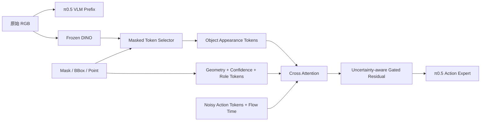

# 可以工程上对齐，但需要换一个更有辨识度的问题定义。

截至 2026 年 7 月，单纯做：

> DINO/SAM 提取目标物体 token → action expert cross\-attention
> 
> 

已经比较拥挤。AffordanceVLA 甚至已经实现了严格单向的 `Understanding → Affordance → Action`，最近的 POT\-VLA 也直接研究 persistent 3D object tokens。因此你的论文不能只强调“object token”，而应强调：

> **不完美目标定位条件下，如何用一个轻量、可插拔、对预训练策略低干扰的 object\-action adapter，提高 VLA 的精确性与鲁棒性。**
> 
> 

**论文缺口对照**

**我建议的切入点**

可以暂定为：

> **Robust Object\-Conditioned Action Adapter for VLA under Imperfect Grounding**
> 
> 

核心问题不是“显式 object token 有没有用”，而是：

> 当 mask、bbox、目标点存在偏移、缺失、误检和遮挡时，action expert 应当何时信任、信任多少，以及不同动作阶段应读取哪些物体信息？
> 
> 

这个问题是上述方法普遍没有系统回答的，而且与你当前工程高度匹配。

**推荐结构**

```Plain Text

```

建议实现：

```Plain Text
delta = CrossAttention(
    query=action_tokens + time_embedding,
    key=object_tokens,
    value=object_tokens,
)

gate = sigmoid(
    gate_mlp(action_tokens, flow_time, object_confidence)
)

action_tokens = action_tokens + gate * delta
```

这里相较 ACoT 多了两个关键点：

1. `Q` 不只是 noisy action，还显式知道 flow timestep。

2. gate 根据条件置信度和动作状态决定是否接受 object information。

**与你当前代码的关系**

你当前代码已经从旧 `pi0.py` object branch 进一步拆出了 `RoVLA` 主线，骨架基本对齐这份问题定义：

- [`src/openpi/models/rovla.py`](/home/dongxiaokun/imitation-learning/openpi/src/openpi/models/rovla.py)：实现轻量 object-action adapter。

- `_semantic_grid()`：优先消费外部 `object_semantic_tokens`，否则复用 frozen PaliGemma image patch tokens，相当于先把 “DINO patch features” 作为可插拔输入接口留出来。

- `_embed_object_condition()`：用 `target_mask / target_bbox / target_point / confidence` 选择 16～32 个 object appearance tokens，并追加 geometry token。

- `_cross_attend_object_condition()`：`Q=action_tokens + flow_time`，`K/V=object_tokens`，并通过 state/time/confidence-conditioned gate 做 residual 注入。

- `rovla_output_proj` 和 `rovla_gate_output_proj` 都是 zero-init，保证旧 checkpoint 初始行为不变。

- [`src/openpi/models/model.py`](/home/dongxiaokun/imitation-learning/openpi/src/openpi/models/model.py)：`Observation` 已包含 `object_condition_confidence` 和 `object_semantic_tokens`，推理侧也可以从外部分割/检测服务直接传入。

- [`src/openpi/training/config.py`](/home/dongxiaokun/imitation-learning/openpi/src/openpi/training/config.py)：`rovla_libero` 已注册，当前 freeze filter 只训练 `rovla_.*` 参数。

它已经和 ACoT 的工程接口对齐了。旧 `pi0.py` object branch 最弱的是 object encoder：

```Plain Text
16×16 RGB/mask/x/y
→ 每个 patch 独立 Linear
→ 没有视觉语义，没有 patch 间关系
```

所以第一步应当把它替换为：

```Plain Text
DINO patch features
+ target mask 对齐到 patch grid
+ 2D position
+ bbox/mask moments
→ 16～32 个 object tokens
```

不要一开始做完整 Which/Where/How，这会直接进入 AffordanceVLA 的战场，而且数据工程太重。

**工程路线**

1. **MVP：验证信息是否有效**

保留现有 cross\-attention，只比较：

```Plain Text
RGB-linear object tokens
DINO full-image tokens
DINO masked-object tokens
bbox-only
mask-only
```

这一步回答增益究竟来自 DINO 容量，还是目标隔离。

2. **核心创新：不完美条件鲁棒性**

训练时主动扰动 object condition：

```Plain Text
mask dilation / erosion
mask translation
随机漏检
错误 distractor mask
bbox jitter
target point noise
```

加入 `condition_confidence` 和 gated residual，评估成功率随噪声强度的曲线。

3. **动作阶段感知**

让 gate 或 cross\-attention query 接收：

```Plain Text
flow timestep
action-token position
可选的 interaction-progress scalar
```

验证 approach、contact、transport、release 阶段是否出现不同注意模式。

4. **关系任务扩展**

单目标 token 对 place/insert 不够，后续加入角色：

```Plain Text
source-object tokens
target/receptacle tokens
```

但这是第二阶段，不要阻塞第一版。

**最关键的实验**

除了 LIBERO 平均成功率，应专门报告：

- clutter / distractor robustness

- mask IoU 下降时的成功率曲线

- bbox 偏移与目标点噪声

- target condition 完全缺失时是否退化回原始 π0\.5

- 抓取接触误差、放置终点误差

- 参数量、延迟、训练 GPU 成本

- adapter\-only 与 full fine\-tuning 对比

最有说服力的结果不是“干净条件下提高 2%”，而是：

> 干净输入保持或小幅提升；定位条件变差时明显优于直接注入；条件缺失时接近原始 π0\.5，不发生灾难性退化。
> 
> 

**结论**

你应该工程上对齐 ACoT 的 `Action Query ← Conditional KV` 接口，但研究问题对齐到“可靠条件注入”，而不是再造一个 affordance expert。

最适合当前工程的主线是：

```Plain Text
Frozen DINO masked tokens
+ explicit geometry
+ uncertainty-aware, timestep-conditioned gated cross-attention
+ grounding corruption benchmark
```

这条路线改动集中、能复用现有 π0\.5 checkpoint，也和 AffordanceVLA 的重型多阶段 affordance forecasting、LiLo 的模块化规划系统、POT\-VLA 的 persistent 3D records 拉开了距离。

**2026-07-23 当前进展**

当前工程已经从“概念对齐”推进到“可验证 GT object condition 是否有效”的状态：

- `RoVLA` 已经作为独立模型分支接入，`rovla_libero` 配置会冻结原始 π0.5，只训练 `rovla_.*` adapter 参数。

- `Observation` 已支持 `target_mask / target_bbox / target_crop / target_point / object_condition_confidence / object_semantic_tokens`，因此 GT mask、在线 YOLO mask、未来 DINO patch tokens 都可以走同一条接口。

- `LiberoInputs` 已加入可选 `object_condition_provider` hook。训练数据里已经有 GT target condition 时不覆盖；推理时如果没有显式 `target_*`，可以把 `observation/image` 送给外部 detector/segmenter 生成 condition。

- 已新增 `UltralyticsObjectConditionProvider`，可以把本地 `ultralytics/` clone 和 YOLO-seg 权重包装成 RoVLA 输入字段：

```Plain Text
image + optional prompt
→ YOLO-seg
→ target_mask + target_bbox + target_crop + object_condition_confidence
→ RoVLA
```

- 已新增 `scripts/overlay_libero_yolo_masks.py`，可以在 LIBERO 图像上叠加 GT mask 和 YOLO mask。颜色约定：

```Plain Text
绿色：LIBERO GT mask / bbox
红色：YOLO mask / bbox
黄色：GT 与 YOLO 重叠区域
```

- `data/lerobot/local/libero_object_mask` 已完成一次全量数据体检：

```Plain Text
episodes: 500
frames: 74,507
字段缺失: 0
shape 异常: 0
NaN/Inf: 0
empty masks: 1,260 frames，占 1.69%
target_bbox 与 target_mask 重新计算 bbox: 完全一致
mask area min / p1 / median / p99 / max: 0 / 0 / 96 / 203 / 261
```

结论：这个数据集结构上是干净的，适合先验证 GT object condition。少量空 mask 可以视作自然缺失条件；若做 GT 上限实验，可以额外过滤空 mask 帧。

**当前判断**

下一步不应马上训练 YOLO，也不应马上引入 DINO/SAM。更好的顺序是：

```Plain Text
先验证 GT-mask 条件是否能提升 RoVLA
→ 再验证 GT 条件在扰动/缺失下是否鲁棒
→ 再引入 YOLO 作为 noisy online condition
→ 最后考虑 DINO/小 ViT semantic tokens 是否带来额外收益
```

原因是：如果 GT-mask 都没有效果，问题在 adapter 注入、训练策略或数据任务定义；此时接 YOLO 只会把感知误差和策略误差混在一起。如果 GT-mask 有明显效果，再接 YOLO 才能定量回答“在线轻量感知损失了多少、鲁棒 adapter 能救回多少”。

**短期实验计划**

1. **GT-mask RoVLA smoke train**

先用 `rovla_libero` 跑短训练，确认 loss、batch、checkpoint 保存都正常：

```Plain Text
.venv/bin/python scripts/train.py rovla_libero
```

如果只是调通，建议先把 `num_train_steps` 降到 20～100，`num_workers=0` 保持不变，方便 debug。

2. **GT condition 是否有效**

比较：

```Plain Text
A. pi05_libero baseline，不传 object condition
B. rovla_libero，传 GT target_mask + target_bbox + target_crop
C. rovla_libero，但评估时置空 target condition
```

理想结果：

```Plain Text
B > A
C 接近 A
```

这说明 object condition 有收益，而且缺失时不会灾难性退化。

3. **不完美条件鲁棒性**

在评估或训练中系统扰动：

```Plain Text
mask translation
mask dilation / erosion
bbox jitter
随机漏检
错误 distractor mask
confidence 衰减
```

报告成功率随扰动强度变化的曲线，而不是只报一个平均分。

4. **YOLO 作为 noisy condition**

在 GT 条件有效后，再做：

```Plain Text
GT-mask 上限
YOLO-mask 直接输入
YOLO-mask + confidence gate
YOLO-mask + corruption-trained RoVLA
```

已有 overlay 脚本可先目检 `checkpoints/yolo26s-seg.pt` 在 LIBERO 上的分割质量。如果 YOLO 目标类别不匹配或红色 mask 很偏，再考虑用 LIBERO GT mask 导出 Ultralytics segmentation 数据集进行 fine-tuning。

**中期规划**

- **数据导出**：把 LIBERO `image + target_mask` 转成 Ultralytics segmentation 格式，用于训练小 YOLO-seg student。

- **在线同步**：YOLO 不并入 JAX 模型，而是作为异步 perception worker。policy loop 消费最新 `{timestamp, bbox, mask, confidence}`，过期则降低 confidence 或置空 condition。

- **轻量感知对比**：

```Plain Text
GT mask
YOLO-seg
YOLO-det + bbox-only
YOLO-det + MobileSAM
DINOv2-S / 小 ViT semantic tokens
GroundingDINO + SAM teacher
```

- **论文主线**：强调可靠条件注入，而不是“又一个 object token 方法”：

```Plain Text
Robust Object-Conditioned Action Adapter for VLA under Imperfect Grounding
```

核心实验要证明：

```Plain Text
干净 GT 条件下能提升；
条件缺失时接近原始 π0.5；
条件变差时比直接注入更稳；
轻量 YOLO condition 虽有噪声，但通过 confidence gate 和 corruption training 仍能带来实际收益。
```
